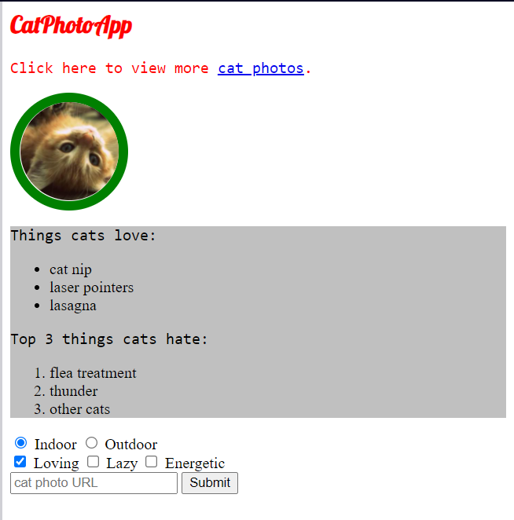

# Day 6️⃣

## 👨‍💻 Coded 👨‍💻

# 📚 Learning 📚

Yup, It's Day 6 of 100daysofcode. I have started learning CSS from none other than FreeCodeCamp it's called Basic CSS. 
You can also follow this amazing course here: [Basic CSS](https://www.freecodecamp.org/learn/responsive-web-design/#basic-css) 

So, What the hack I learned Today:
- how to **change color** of text
- CSS **Seletors**
- CSS **class** to style element
    - how to style multiple elements
- Learned about **Fonts**
    - How to change font size
    - Learned about font family
    - how to import font from google
    - **Degrade font**(when one font is not available we can use other fonts. Basicaly adding multiple fonts in font-family so that if one is missing we can use other.)
- Resize your Image.
- Learned about **Borders**
    - how to add border to your element
    - circular border

## 🔗 Links

connect with me.

  
